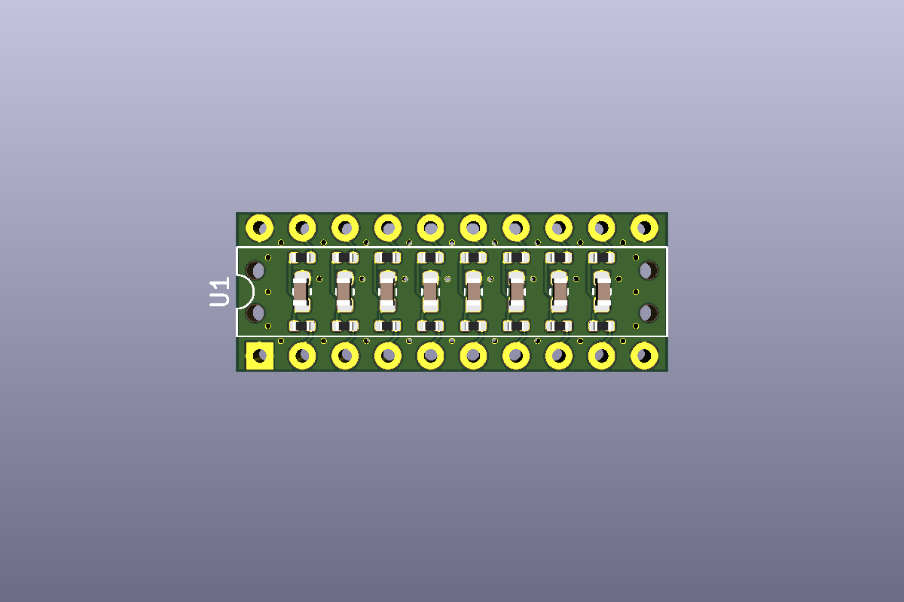
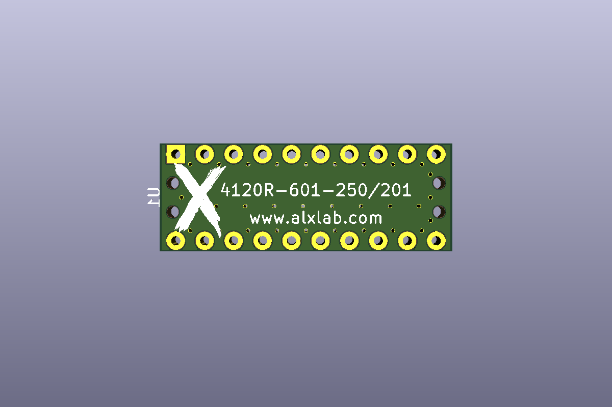
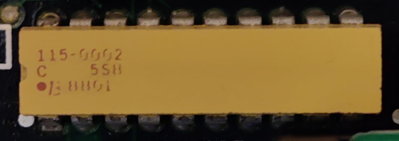
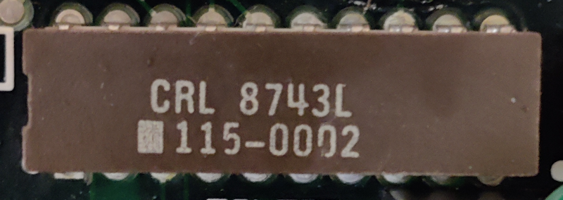
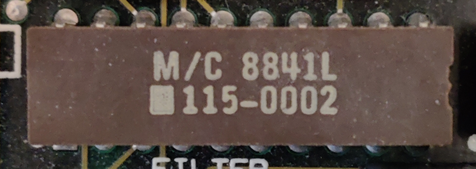

# Bourns 601 Series - RC Network T-Filters

This is a recreation the discontinued *Bourns 4120R-601-250/201* DIP used on the Macintosh SE and Macintosh SE/30. The filter chip also goes by the model numbers *M/C 8908L 115-0002*, *CRL 8743L 115-0002* or *P9120M115-0006*. 

Pictures of the chips:

Even though the Kicad and EasyEDA files are geared towards the *4120R-601-250/201* specifically,  the capacitor and resistor values can be changed  to make other discontinued Bourns 601 Series filters:

| Part Number       | Resistor Value | Capacitor Value |
| ----------------- | -------------- | --------------- |
| 4120R-601-101/101 | 100 ohm        | 100 pF          |
| 4120R-601-101/181 | 100 ohm        | 180 pF          |
| 4120R-601-101/201 | 100 ohm        | 200 pF          |
| 4120R-601-250/101 | 25 ohm         | 100 pF          |
| 4120R-601-250/181 | 25 ohm         | 180 pF          |
| 4120R-601-250/201 | 25 ohm         | 200 pF          |
| 4120R-601-250/500 | 25 ohm         | 50 pF           |
| 4120R-601-270/101 | 27 ohm         | 100 pF          |
| 4120R-601-270/201 | 27 ohm         | 200 pF          |
| 4120R-601-270/500 | 27 ohm         | 50 pF           |
| 4120R-601-470/101 | 47 ohm         | 100 pF          |
| 4120R-601-470/201 | 47 ohm         | 200 pF          |
| 4120R-601-470/500 | 47 ohm         | 50 pF           |
| 4120R-601-820/101 | 82 ohm         | 100 pF          |
| 4120R-601-820/201 | 82 ohm         | 200 pF          |
| 4120R-601-820/500 | 82 ohm         | 50 pF           |

If the part number your looking for isn't listed, please refer to the [datasheet](docs/datasheets/Bourns_4120R-601-250_201.pdf).

## Bill of Materials

4120R-601-250/201

| Quantity | Description                                              | Designators | Product Number  | Datasheet                                                    |
| :------- | -------------------------------------------------------- | ----------- | --------------- | ------------------------------------------------------------ |
| 16       | 25 Ohm resistor - 0402 (original 25V, ±10%)              | R1-R16      | 0402WGF255JTCE  | [datasheet](docs/datasheets/R1-R16_2110260430_UNI-ROYAL-Uniroyal-Elec-0402WGF255JTCE_C129579.pdf) |
| 8        | 200 pF capacitor - 0603 (original Z5U, ±30% capacitance) | C1-C8       | 0603CG201J500NT | [datasheet](docs/datasheets/C1-C8_1811061810_FH-Guangdong-Fenghua-Advanced-Tech-0603B201K500NT_C1600.pdf) |
| 2        | 10-pin male header 0.1" (2.54mm) pitch                   |             |                 |                                                              |

## Manufacturing

The release includes the manufacturing files for JLCPCB specifically for a 8 column and 3 row panel. The pick and place file includes all the components already placed for the panel. I recommend a PCB thickness of 1mm or less if you do panelization to make the PCBs easier to separate.

When you place an order with JLCPCB the `Delivery Format` should be `Panel by Customer` . The `Panel Format` should be `Column: 8` and `Row: 3`.

For the `Bill of Materials`  part of the order where you upload the BOM and Pick and Place files there is an option at the bottom called `File provided as`. You should select `Complete File, just proceed with my own files ` since the pick and place file has all the component placements for the panel.

If you had selected everything properly you should get a total of 1930 resistors and 960 capacitors for a minimum order of 5 panels. The preview should also show all the components in the right spots. Ignore the fact that the cuts in between the individual PCBs of the panel don't show up in the component placement preview. This is normal when doing the panelization with EasyEDA.

If you need to the gerber files, BOM or component pick & place in a different format then you would have to generate them yourself.

## License

Bourns 601 Series - RC Network T-Filters by [Alexandre Marcoux](https://github.com/alxlab-zone66x/Bourns-601-Series-RC-Network-T-Filters) is licensed under a [Creative Commons Attribution 4.0 International License](http://creativecommons.org/licenses/by/4.0/).

## Community

For more great retro hardware projects and a great community check out:

Join us in #skunkworks on [Discord](https://discord.gg/GKcvtgU7P9) to help make retro solutions available to all.

